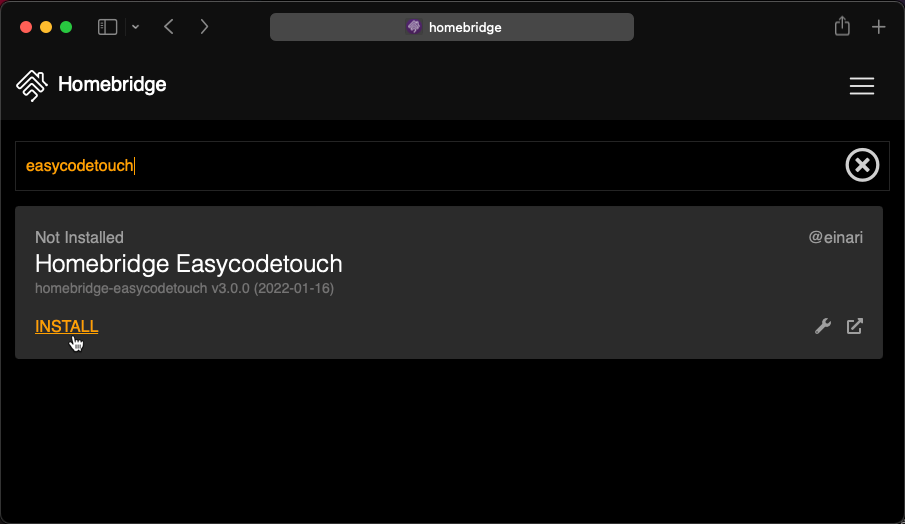
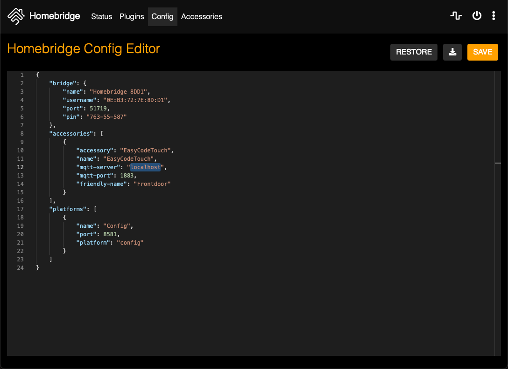

# EasyCodeTouch for Homebridge

[](https://github.com/einari/easycodetouch/actions/workflows/build.yml)
[](https://badge.fury.io/js/homebridge-easycodetouch)

This repository holds a [Homebridge](https://homebridge.io) plugin that enables the use of the [Easy Access](https://easyaccess.no) product called
[Easy Code Touch](https://easyaccess.no/product/easycodetouch/).

Have a look at the [changelog](./CHANGELOG.md) for details on all versions.

## Prerequisites

You'll need to have the [Zigbee / BLE](https://easyaccess.no/product/easyring-lock-module/) installed in the
lock.

This plugin relies on MQTT and specifically the protocol defined by Easy Access. The easiest would be
to use something like [Zigbee2MQTT](https://www.zigbee2mqtt.io). The protocol in question is defined [here](https://www.zigbee2mqtt.io/devices/easyCodeTouch_v1.html#onesti-products-as-easycodetouch-v1).

## Install

If you're using the Homebridge UI, you can simply find and install the plugin from there:



Then you need to configure one or more accessories (you can have multiple, if you have multiple locks).
Open the configuration editor in the UI and locate the `accessories` key and add something like below:



The configuration object:

```json
"accessories": [
    {
        "accessory": "EasyCodeTouch",
        "name": "EasyCodeTouch",
        "mqtt-server": "localhost",
        "mqtt-port": 1883,
        "friendly-name": "Frontdoor"
    }
]
```

## Build

You'll need [Yarn](https://yarnpkg.com) to leverage the scripts in the `package.json` file.

For development purposes, install a local Homebridge on your dev-box:

```shell
sudo npm install -g --unsafe-perm homebridge homebridge-config-ui-x
```

> Note: You can drop the last package, if you don't want to have the Homebridge UI.

Then you can run this plugin with watch:

```shell
yarn watch
```
